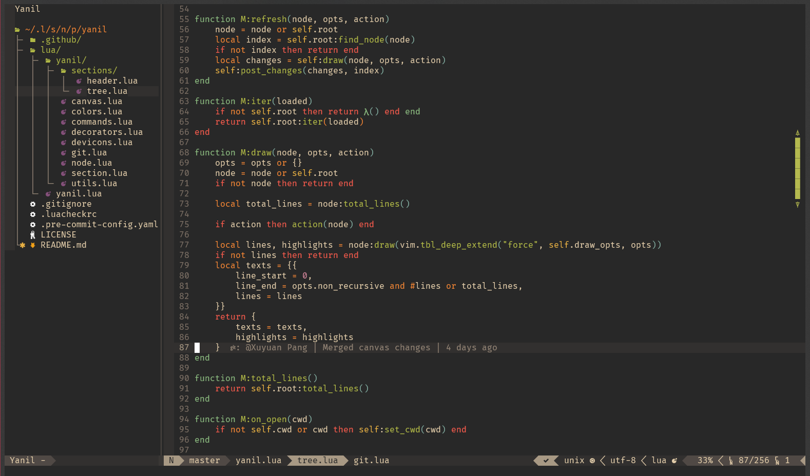

_Note_: The sole reason that this fork exists is that things we're collapsing on my system due to the unix `file` utility having a seemingly intractable bug which makes `file -p [file]` fail with `SIGSYS` (!). So what do we do? We just omit the `-p` flag and there we go (and maybe also look for a better solution in the long term).

The rest of this README is basically taken as-is from the [original repository](https://github.com/Xuyuanp/yanil).

----

# Yanil
Yet Another Nerdtree In Lua

This not an out-of-box nerdtree alternative (and won't be), but a lib to build your own nerdtree.

## Prerequisites

* `neovim-0.5.0` or higher.

## Installation

`Plug 'BiCapitalization/yanil'`

## Setup

It's not very easy to make it work (It's just a lib).
A [sample config](https://github.com/Xuyuanp/vimrc/blob/master/lua/dotvim/yanil.lua) can be found in my personal dotfile.

## Note

This plugin is in very early stages and has no backward compatibility guarantees.

### Known issues

* Not support for windows
* Not support for multi tabs
* ...

## Credits

* [nerdtree](https://github.com/preservim/nerdtree): It's one of the greatest vim plugin.
* [nvim-tree.lua](https://github.com/kyazdani42/nvim-tree.lua): I learned a lot from it in prototype stage.
